# Predicting-Employee-Attrition-for-Augmenting-Institutional-Yield

Employee Attrition    |  
:-------------------------:|
 |

Employee Attrition can be defined as the natural process in which the employees of an organization or an institution leave the workforce and are not immediately replaced. The reason for attrition can range from personal reasons such as low salaries to hostile work environments. Employee attrition can be categorized into two categories, viz Voluntary Attrition and Involuntary Attrition. Voluntary attrition implies that the employee leaves an organization due to personal reasons. On the other hand, involuntary attrition occurs when an employee is removed from the organization due to low productivity or other reasons. Loss of employees via attrition has severe impacts on the yield of an organization. Finding eligible candidates to replace the ones that have left is a daunting task. This not only leads to higher costs but also induces a relatively inexperienced workforce in the organization. Continuous employee loss also disrupts the work chain and leads to delayed deadlines and lower customer satisfaction. Higher employee attrition diminishes the brand value of an organization.

---
## Outline

1. [Introduction](#introduction)
2. [Literature Survey](#literature-survey)
3. [Dataset](#dataset)
   * [Exploratory Data Analysis](#exploratory-data-analysis)
   * [Data Preparation and Preprocessing](#data-preparation-and-preprocessing)
4. [Methodology](#methodology)
   * [Classification Techniques](#classification-techniques)
   * [Evaluation](#evaluation)
5. [Results and Analysis](#results-and-analysis)
6. [Conclusions](#conclusions)
7. [References](#references)

---

## Project Description
### Introduction
In this project, the team strives to use machine learning principles to predict employee attrition, provide managerial insights to prevent attrition, and finally rule out and present the factors that lead to attrition. The project employs the use of models like Logistic Regression, Naive Bayes Classifier, Decision Trees, Random Forests, SVM and Multi Layer Perceptron on an IBM Watson generated synthetic data set.

### Literature Survey
The paper [1] starts off with describing what is employee attrition, and why it is a major issue faced by institutions across the globe. The paper aimed at predicting Voluntary Employee Attrition within a company using a K-Nearest Neighbours Algorithm, and compare its performance with other models, including Naive Bayes, Logistic Regression and NLP. The authors performed data preprocessing by converting categorical feature values into numerical ones, like converting salary values, that were either ”low”, ”medium” and ”high” to 0,1 and 2. A 70-30 train-test split was created on the data set, and the various model”s performances were evaluated using metrics like Area-Under-Curve, Accuracy and F1 Score. The results of this research showed the superiority of the KNN classifier in terms of accuracy and predictive effectiveness, by means of the ROC curve.  

The second paper [2] talked about how classification algorithms often perform unreliably on data sets with large sizes. These data-sets are also often prone to class imbalances, redundant features or noise. The paper applied dimensionality reduction by PCA on the Lung-Cancer dataset, which was followed by a SMOTE re-sampling to balance the different class distributions. This was followed by applying a Naive-Bayes Classifier on the modified data set, the performance of which was evaluated across four metrics: Overall accuracy, False Positive Rate, Precision and Recall.The results obtained showed that the least misclassifications occurred when PCA was applied followed by applying SMOTE re-sampling twice. Applying SMOTE twice balanced the distributions of the two minority classes, thus giving the best results.

### Dataset
The data set is a fictional data set created by IBM data scientists. It has 1470 instances and 34 features (27 numerical and 7 categorical) describing each employee. The target variable - "Attrition" is imbalanced. We have 83% of employees who have not left the company and 17% who have left the company. If one variable is highly correlated to another variable, it will lead to skewed or misleading results.  

Correlation Matrix   |  
:-------------------------:|
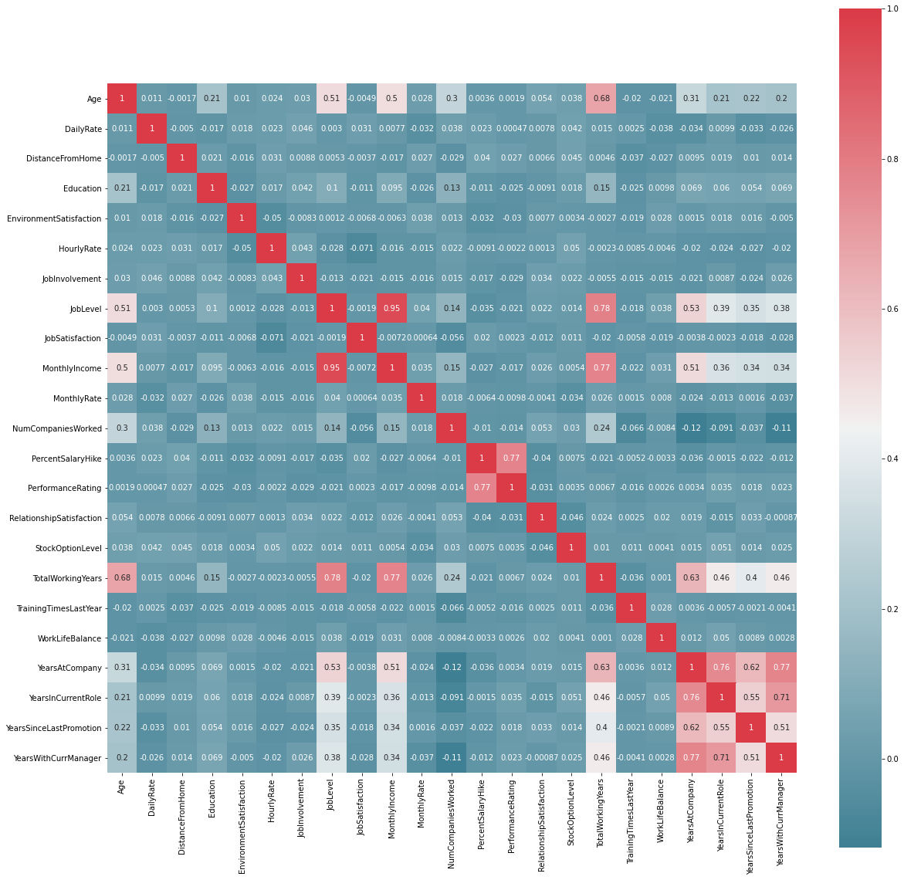 |

#### Exploratory Data Analysis

Attrition Rates   |  
:-------------------------:|
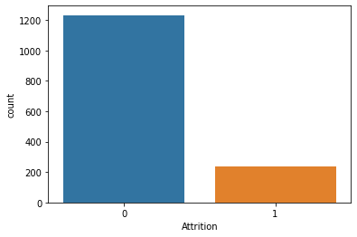 |

As seen from above plot, there is a severe class imbalance in the attrition class and the value of 'No' or 0 far outweigh the 'Yes' or 1.  

Age vs Attrition Rates   |  
:-------------------------:|
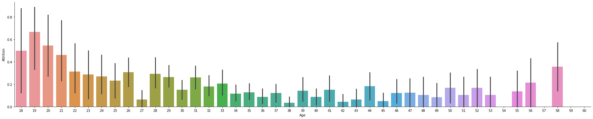 |

Younger people tend have to higher attrition rates.  

Department vs Attrition Rates   |  
:-------------------------:|
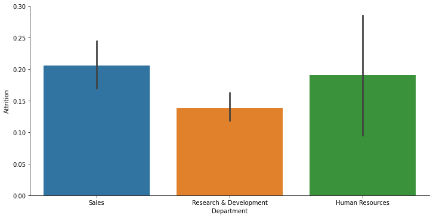 |

The Sales Department has the highest attrition with human resources being slightly less than it.  

Job Role vs Attrition Rates   |  
:-------------------------:|
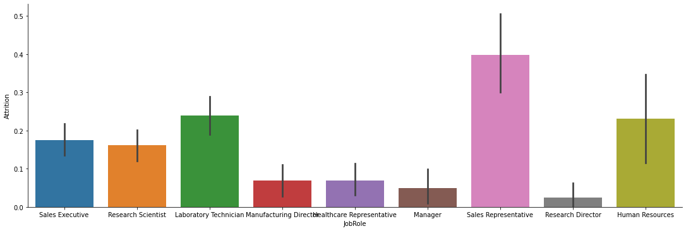 |

The job role with the least attrition is of a ResearchDirector and the one with maximum attrition is of a Sales Representative.  

Gender vs Attrition Rates   |  
:-------------------------:|
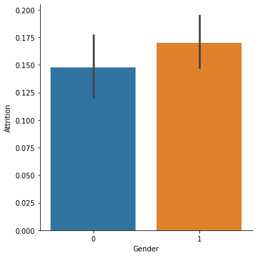 |

The Male employees tend to have a higher attrition rate as compared to females.

Marital Status vs Attrition Rates   |  
:-------------------------:|
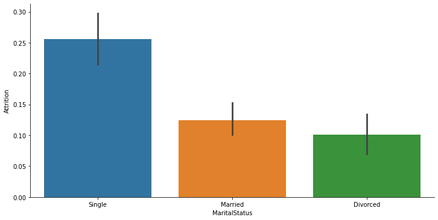 |

Single employees tend to have higher attrition. 

Overtime vs Attrition Rates   |  
:-------------------------:|
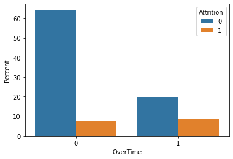 |

People who overtime have a higher chances of leaving the organization.     

Holistic Satisfaction vs Attrition Rates   |  
:-------------------------:|
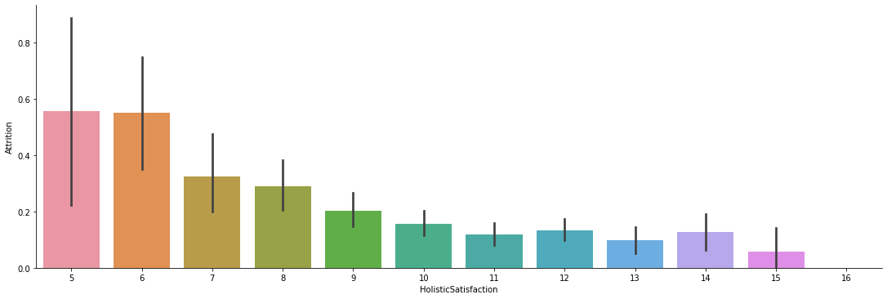 |

Employees with less Holistic Satisfaction tend to leave the organization.   

Monthly Income vs Attrition Rates   |  
:-------------------------:|
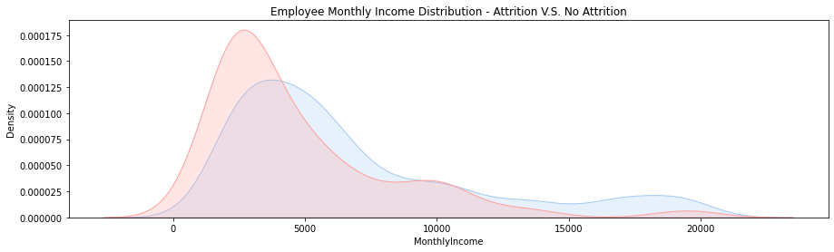 |

People with lower monthly income have a higher attrition rate.

#### Data Preparation and Preprocessing
Following steps were undertaken in data preprocessing and preparation:
1. **Changing Datatypes**  &#8594; There are some string variables in the data set ("Attrition", "Overtime", "Gender") which were binarized. Categorical attributes were transformed using one-hot encoding. A new attribute "Holistic-Satisfaction" has been added which represents the sum of values of the attributes "EnvironmentSatisfaction", "JobSatisfaction", "JobInvolvement" and "RelationshipSatisfaction". Employees with less "HolisticSatisfaction" tend to leave the organization.
2. **Feature Selection**  &#8594; There are some attributes that are meaningless to the attrition prediction. "EmployeeCount", "Over18" and "StandardHours" have the same value for all the employees. Also, "EmployeeNumber" according to its definition represents the employee's ID. As these attributes don”t provide any information for prediction. So, these attributes were dropped from the data set. Further feature selection was conducted later in different models. 
3. **Removal of Outliers**  &#8594; To increase the accuracy of the models, we removed the outliers of the numeric attributes "MonthlyIncome", "TotalWorkingYears" and "YearsAtCompany" by calculating ZScore. The numeric variables which are actually representing some categories were not taken into consideration.
4. **Feature Normalization and Scaling**  &#8594;  The goal is to change the values of numeric attributes in the data set to use a common scale. The numeric attributes, "Age", "DailyRate" etc. are highly skewed. So, these skewed features are normalized.

### Methodology
#### Classification Techniques
* The data-set is highly imbalanced, therefore, for all classification algorithms three separate instances of data-set are prepared viz baseline(without any change), up-sampling (the minority class using SMOTE) and down-sampling (the majority class using sklearn resample). 
* Then the classification methods are applied on all the three instances. The classification techniques that have been used within the domain of the project are Logistic Regression, Gaussian Naive Bayes, Decision Tree Classifier, Random Forest Classifier, Perceptron, Multi-Layer Perceptron and SVM/SVC.  
* For Decision Trees and Random Forests initially a grid search is done to get the optimal depth and then the further investigation was carried on.  
* For MLP, initially a search is done to get the optimal number of hidden layers and then a search to find the optimal number of hidden units in those layers. Finally, the MLP was tested with all the variations of the activation functions viz. identity, logistic, sigmoid, tanh. For the Support Vector Classifier(SVM/SVC) the results with all the kernels were explored.  
* Since the dataset is highly imbalanced, algorithms such as XGBoostClassifier and Gradient Boosting(which are used in these scenarios) with employing a grid search initially to get the optimal depths for both. 
* In the end, KMeans clustering (unsupervised learning algorithm) was also employed for they are used in anomaly detection and class imbalance this severe can act somewhat equivalent to anomaly detection.

#### Evaluation
* Since the data set is highly imbalanced with the negative class having 84% of the total instances, accuracy is not a good measure for model comparison as any naive classifier
would also yield 84% accuracy.
* Precision, however, can be a metric that can be used to compare the models as it only takes into consideration the positive class and we are least interested in true negatives. 
* Recall can also provide an insight of how well is the minority class detected. 
* In simpler terms, precision defines how correctly is the minor class being detected and recall states how much is the minor class being detected. 
* For the generation of the statistics,inbuilt methods from Sklearn are used. The scores provided for all the metrics are obtained after performing kfold cross validation to eliminate the chance of a favourable or an unfavourable split.
* After this ROC curve and PR(Precision Recall) Curves were drawn for all the models.
* The ROC curve plots True Positive Rate (Y axis) and False Positive Rate (X axis) tells us about the measure of separability of a model.
* The Precision-Recall curve displays the fact that whether a class is being detected(recall) and if it is being detected what is the degree of correctness(precision) of that detection.

### Results and Analysis
Evaluation Scores for Baseline Settings:
|Model|Accuracy|Precision|Recall|
|----|---------|---------|------|
|Logistic Regression |89.38 |80.91 |44.41|
|Gaussian-NB |41.52 |19.86 |89.22|
|Decision Tree |82.03 |41.96| 33.95|
|Random Forest| 86.62 |91.75| 17.15|
|Perceptron| 79.67 |59.03 |53.87|
|MLP |88.87 |78.11 |42.23|
|SVM |89.31 |82.27| 41.96|
|Gradient Boosting| 86.26 |65.86 |32.86
|XGBoost| 87.42| 72.43 |34.59|
|KMeans| 51.47 |16.99 |48.38|

Evaluation Scores for Upsampled Settings:
|Model|Accuracy|Precision|Recall|
|----|---------|---------|------|
|Logistic Regression |77.74 |39.22 |73.26|
|GaussianNB |46.25 |20.7| 85.14|
|Decision Tree |77.75 |32.77 |35.99|
|Random Forest| 86.62 |69.98 |30.81|
|Perceptron |75.4| 43.9 |68.23|
|MLP |79.63 |41.61 |69.23|
|SVM |77.53 |38.69 |72.34|
|Gradient Boosting |86.76 |63.91 |39.52|
|XGBoost |87.27 |67.28| 38.4|
|KMeans |53.3 |18.45 |52.27|

Evaluation Scores for Downsampled Settings:
|Model|Accuracy|Precision|Recall|
|----|---------|---------|------|
|Logistic Regression| 74.54| 35.64| 74.97|
|Gaussian-NB| 37.75 |19.04 |90.56|
|Decision Tree| 62.62| 24.68 |65.98|
|Random Forest| 74.11 |34.79| 73.07|
|Perceptron| 60.14| 36.47| 74.21|
|MLP| 74.39| 35.01| 72.47|
|SVM| 76.21| 37.44 |75.04|
|Gradient Boosing| 73.09| 33.6| 71.47|
|XGBoost| 73.46| 33.54 |44.87|
|KMeans| 50.48| 17.27 |52.05|

Depth v/s Metrics For Decision Trees| Depth v/s Metrics for Random Forest  |
:-------------------------:|:-----------------:|
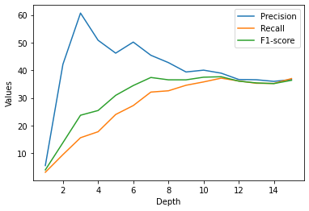 |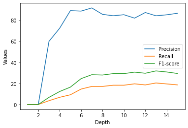|

Depth v/s Metrics For XGBoost| Depth v/s Metrics for Gradient Boosting Classifier|
:-------------------------:|:-----------------:|
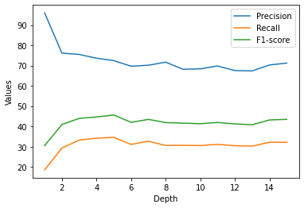 |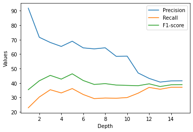|

Depth v/s Metrics For No. of Hidden Layers in MLP| Depth v/s Metrics for No. of Hidden Units in MLP(1 Hidden Layer)  |
:-------------------------:|:-----------------:|
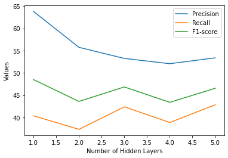 |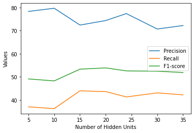|

ROC Curve | PR Curve  |
:-------------------------:|:-----------------:|
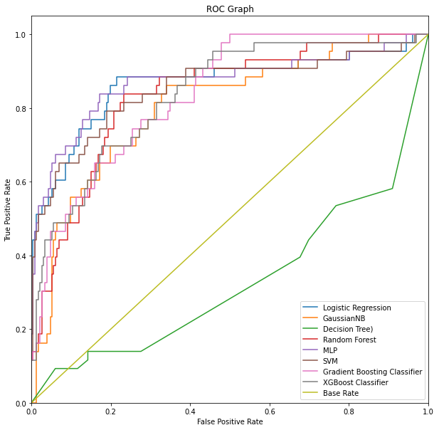 |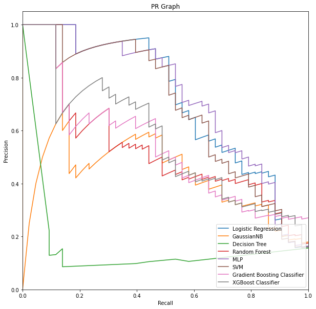|

### Conclusions
1. As seen from accuracy values of baseline condition we can conclude that accuracy indeed is not a good metric in case of imbalanced data. 
2. Up-sampling the minority class by generating synthetic samples lead to better detection of the minority class but the degree of trust in that detection falls down. 
3. The trend is even steeper when the majority class is down-sampled. 
4. The higher precision and lower recall values in baseline condition concludes that the minority class is not detected much but whenever detected the degree of trust is high. 
5. On contrary, the higher recall and lower precision value concludes that even though the minority class is being detected but the degree of trust in that detection is very low. 
6. The models specialized for imbalanced class scenarios showed promising outcomes in all the metrics. 
7. Finally, it can be concluded that Random Forest, MLP, XGBoost, Gradient Boosting, Logistic Regression are the best models among the above mentioned.
8. Unsupervised Clustering Algorithms failed at proper prediction. 
9. The important features extracted after application of random forest coincide with the real world which conclude that the model has real world uses despite being trained on a synthetic data-set.

### References
1. [Rahul Yedida, Rahul Reddy, Rakshit Vahi, Rahul Jana, Abhilash GV, Deepti Kulkarni. "Employee Attrition Prediction". 02 November 2018.](https://arxiv.org/abs/1806.10480)
2. [Mehdi Naseriparsa, Mohammad Mansour Riahi Kashani "Combination of PCA with SMOTE Resampling to Boost the Prediction Rate in Lung Cancer Dataset".](https://arxiv.org/abs/1403.1949)
